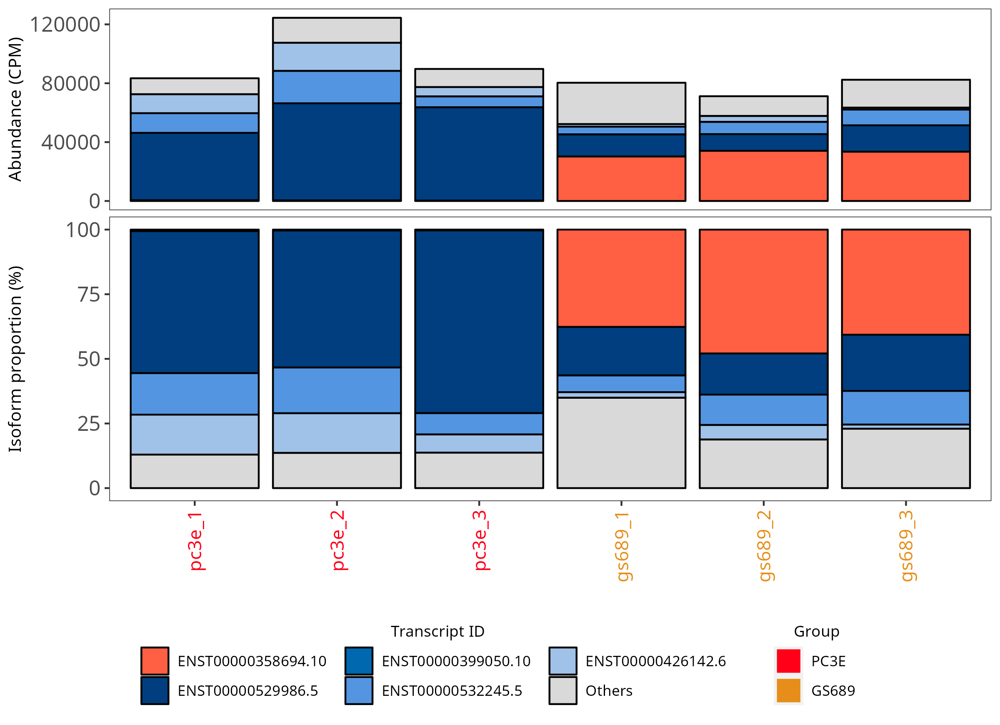
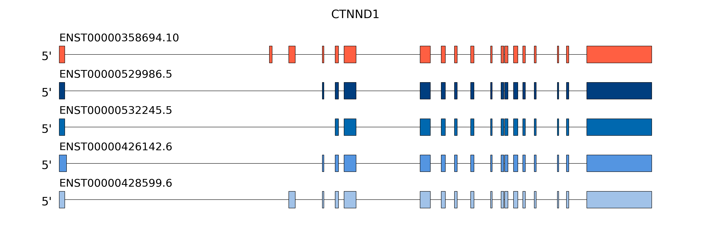

# rMATS-long

## About

rMATS-long is a collection of tools for analyzing long-read data

## Table of Contents

* [Dependencies](#dependencies)
* [Usage](#usage)
  + [Detect Differential Isoforms](#detect-differential-isoforms)
  + [Visualize Isoforms and Abundance](#visualize-isoforms-and-abundance)
  + [Classify Isoform Differences](#classify-isoform-differences)
  + [Example](#example)

## Dependencies

Dependencies can be installed to a conda environment by running [./install](./install). Then the scripts can be run when the conda environment is activated: `conda activate ./conda_env`

* [Python](https://www.python.org/) (v3.10.9)
  + [NetworkX](https://networkx.org/) (v2.8.8)
  + [NumPy](https://numpy.org/) (v1.24.2)
  + [pandas](https://pandas.pydata.org/) (v1.5.3)
  + [matplotlib](https://matplotlib.org/) (v3.7.1)
* [R](https://www.r-project.org/) (v4.2.0)
  + [BiocParallel](https://bioconductor.org/packages/release/bioc/html/BiocParallel.html) (v1.32.5)
  + [DRIMSeq](https://bioconductor.org/packages/release/bioc/html/DRIMSeq.html) (v1.26.0)
  + [ggplot2](https://ggplot2.tidyverse.org/) (v3.4.1)
  + [cowplot](https://wilkelab.org/cowplot/index.html) (v1.1.1)

Those versions were used during testing. Other versions may also be compatible

## Usage

First run [ESPRESSO](https://github.com/Xinglab/espresso) to detect and quantify isoforms using long-read data. The ESPRESSO output can be used to:
* [Detect differential isoform usage](#detect-differential-isoforms): [scripts/detect_differential_isoforms.py](scripts/detect_differential_isoforms.py)
* [Visualize isoforms and abundance](#visualize-isoforms-and-abundance): [scripts/visualize_isoforms.py](scripts/visualize_isoforms.py)
* [Classify isoform differences](#classify-isoform-differences): [scripts/classify_isoform_differences.py](scripts/classify_isoform_differences.py)

### Detect Differential Isoforms

[scripts/detect_differential_isoforms.py](scripts/detect_differential_isoforms.py) detects differential isoform expression using DRIMSeq. The samples in the ESPRESSO abundance file need to be separated into two groups. The two groups are written to the `--group-1` and `--group-2` input files as comma separated lists. The isoform counts from the abundance file are then used in the DRIMSeq pipeline

The main output file written to `--out-dir` is `differential_transcripts.tsv` which has these columns:
* `gene_id`
* `feature_id`: isoform ID
* `lr`: likelihood ratio statistic from DRIMSeq
* `df`: degrees of freedom
* `pvalue`
* `adj_pvalue`: Benjamini & Hochberg adjusted p-values
* `{sample_name}_proportion`: proportion of this isoform among all isoforms in this gene (1 column per sample)
* `group_1_average_proportion`
* `group_2_average_proportion`
* `delta_isoform_proportion`: `group_1_average_proportion - group_2_average_proportion`

The proportion columns were appended to the original output from DRIMSeq.

The `--out-dir` also contains these files output by DRIMSeq:
* `differential_genes.tsv`
* `gene_pvalues.png`
* `precision_by_gene_expression.png`
* `transcript_pvalues.png`
* `transcripts_per_gene.png`

A summary of the number of isoforms and genes passing the default filters will be printed to stdout. The counts using different filters can be printed using [scripts/count_significant_isoforms.py](scripts/count_significant_isoforms.py)

```
python detect_differential_isoforms.py -h

usage: detect_differential_isoforms.py [-h] --abundance ABUNDANCE --out-dir
                                       OUT_DIR --group-1 GROUP_1 --group-2
                                       GROUP_2 [--num-threads NUM_THREADS]

Detect differential isoform expression using DRIMSeq

options:
  -h, --help            show this help message and exit
  --abundance ABUNDANCE
                        The path to abundance.esp file from ESPRESSO
  --out-dir OUT_DIR     The path to use as output directory
  --group-1 GROUP_1     The path to a file listing the sample names for group
                        1. The file should have a single line with the sample
                        names as a comma separated list. The sample names
                        should match with the ESPRESSO abundance column names.
  --group-2 GROUP_2     The path to a file listing the sample names for group
                        2.
  --num-threads NUM_THREADS
                        The number of threads to use (default: 1)
```

```
python count_significant_isoforms.py -h

usage: count_significant_isoforms.py [-h] --diff-transcripts DIFF_TRANSCRIPTS
                                     [--adj-pvalue ADJ_PVALUE]
                                     [--delta-proportion DELTA_PROPORTION]

Count isoforms that meet cutoffs

options:
  -h, --help            show this help message and exit
  --diff-transcripts DIFF_TRANSCRIPTS
                        The path to the differential transcript results
  --adj-pvalue ADJ_PVALUE
                        The cutoff for adjusted p-value (default: 0.05)
  --delta-proportion DELTA_PROPORTION
                        The cutoff for delta isoform proportion (default: 0.1)
```

### Visualize Isoforms and Abundance

[scripts/visualize_isoforms.py](scripts/visualize_isoforms.py) creates plots showing the isoform abundance and structure. The `--gene-id` and `--main-transcript-id` can be selected from the [differential isoform test](#detect-differential-isoforms). The `--abundance` and `--updated-gtf` files are from the ESPRESSO output

```
python visualize_isoforms.py -h

usage: visualize_isoforms.py [-h] --gene-id GENE_ID [--gene-name GENE_NAME]
                             --abundance ABUNDANCE --updated-gtf UPDATED_GTF
                             --out-dir OUT_DIR [--plot-file-type {.pdf,.png}]
                             --main-transcript-id MAIN_TRANSCRIPT_ID
                             [--max-transcripts MAX_TRANSCRIPTS]
                             [--intron-scaling INTRON_SCALING]
                             [--group-1 GROUP_1] [--group-2 GROUP_2]
                             [--group-1-name GROUP_1_NAME]
                             [--group-2-name GROUP_2_NAME]

Visualize the structure and abundance of isoforms

options:
  -h, --help            show this help message and exit
  --gene-id GENE_ID     The gene_id to visualize
  --gene-name GENE_NAME
                        The name for the gene (used as plot title). --gene-id
                        is used as a default
  --abundance ABUNDANCE
                        The path to the abundance.esp file from ESPRESSO
  --updated-gtf UPDATED_GTF
                        The path to the updated.gtf file from ESPRESSO
  --out-dir OUT_DIR     The path to use as the output directory
  --plot-file-type {.pdf,.png}
                        The file type for output plots (default .pdf))
  --main-transcript-id MAIN_TRANSCRIPT_ID
                        The transcript_id of the main transcript to plot
  --max-transcripts MAX_TRANSCRIPTS
                        How many transcripts to plot individually. The
                        remaining transcripts in the gene will be grouped
                        together (max 5, default 5)
  --intron-scaling INTRON_SCALING
                        The factor to use to reduce intron length in the plot.
                        A value of 2 would reduce introns to 1/2 of the
                        original plot length (default 1)
  --group-1 GROUP_1     The path to a file listing the sample names for group
                        1. The file should have a single line with the sample
                        names as a comma separated list. The sample names
                        should match with the ESPRESSO abundance column names.
  --group-2 GROUP_2     The path to a file listing the sample names for group
                        2.
  --group-1-name GROUP_1_NAME
                        A name for group 1 (default group 1)
  --group-2-name GROUP_2_NAME
                        A name for group 2 (default group 2)

```

### Classify Isoform Differences

[scripts/classify_isoform_differences.py](scripts/classify_isoform_differences.py) compares the structures of isoforms within a gene by calling [scripts/FindAltTSEvents.py](scripts/FindAltTSEvents.py) multiple times using a "main" isoform and all other isoforms in a gene

[scripts/FindAltTSEvents.py](scripts/FindAltTSEvents.py) compares the structures of any two transcript isoforms. Local differences in transcript structure are classified into 7 basic alternative splicing categories:


* Exon skipping (SE)
* Alternative 5'-splice site (A5SS)
* Alternative 3'-splice site (A3SS)
* Mutually exclusive exons (MXE)
* Intron retention (RI)
* Alternative first exon (AFE)
* Alternative last exon (ALE)

Any local differences in transcript structure that could not be classified as one of the 7 basic alternative splicing categories are classified as "complex" (COMPLEX). **Note:** It is possible to have combinations of alternative splicing events for any given pair of transcript isoforms.

The output is a tab-delimited file consisting of four fields:
* **Field 1**: ID for transcript isoform 1
* **Field 2**: ID for transcript isoform 2
* **Field 3**: Discovered alternative splicing events
* **Field 4**: Genomic coordinates for alternative splicing events

**Note:** Designation of transcript isoforms 1 and 2 is completely arbitrary. Moreover, if the two transcript isoforms contained in the input GTF file exhibit a combination of multiple alternative splicing events, each event will be reported as its own line in the output file.

```
python classify_isoform_differences.py -h

usage: classify_isoform_differences.py [-h] --main-transcript-id
                                       MAIN_TRANSCRIPT_ID --gtf GTF --out-tsv
                                       OUT_TSV

Compare the structures of isoforms within a gene

options:
  -h, --help            show this help message and exit
  --main-transcript-id MAIN_TRANSCRIPT_ID
                        The transcript_id of the main isoform in the .gtf file
  --gtf GTF             The path to a .gtf describing the isoforms
  --out-tsv OUT_TSV     The path of the output file
```

```
python FindAltTSEvents.py -h

usage: FindAltTSEvents.py [-h] -i /path/to/input/GTF -o /path/to/output/file

This is a script to enumerate all transcript structure differences between a
pair of transcript isoforms

options:
  -h, --help            show this help message and exit
  -i /path/to/input/GTF
                        path to GTF file describing structures of two
                        transcript isoforms
  -o /path/to/output/file
                        path to output file
```

### Example

Example data is provided in [example/data.tar.gz](example/data.tar.gz). Unpack that file with:
```
cd example/
tar -xvf ./data.tar.gz
```

The unpacked files are:
* `example/gencode.v43.annotation_filtered.gtf`
* `example/GRCh38.primary_assembly.genome_filtered.fa`
* `example/group_1.txt`
* `example/group_2.txt`
* `example/gs689_1_filtered.sam`
* `example/gs689_2_filtered.sam`
* `example/gs689_3_filtered.sam`
* `example/pc3e_1_filtered.sam`
* `example/pc3e_2_filtered.sam`
* `example/pc3e_3_filtered.sam`
* `example/samples_N2_R0_abundance.esp`
* `example/samples_N2_R0_updated.gtf`

The example data is based on cell line data from [https://doi.org/10.1126/sciadv.abq5072](https://doi.org/10.1126/sciadv.abq5072). The 1D cDNA sequencing for GS689 and PC3E was processed to get .sam files. The reference data (gencode .gtf and GRCh38 .fa) and the .sam files were filtered to a single region of chr11 (57,500,000-58,000,000) to get a small dataset

The first step is to run [ESPRESSO](https://github.com/Xinglab/espresso) using the provided reference data and alignment files. The result files from ESPRESSO are included in the example data

Next, detect differential isoform usage. The sample names from the abundance file are split into the provided `group_1.txt`:
```
pc3e_1,pc3e_2,pc3e_3

```

and `group_2.txt`:
```
gs689_1,gs689_2,gs689_3
```

Run [scripts/detect_differential_isoforms.py](scripts/detect_differential_isoforms.py):
```
python ./scripts/detect_differential_isoforms.py --abundance ./example/samples_N2_R0_abundance.esp --out-dir ./example_out --group-1 ./example/group_1.txt --group-2 ./example/group_2.txt --num-threads 1
```

That should print: `found 3 isoforms from 1 genes with adj_pvalue <= 0.05 and abs(delta_isoform_proportion) >= 0.1`. One significant row from `example_out/differential_transcripts.tsv` is:
```
gene_id	feature_id	lr	df	pvalue	adj_pvalue	pc3e_1_proportion	pc3e_2_proportion	pc3e_3_proportion	gs689_1_proportion	gs689_2_proportion	gs689_3_proportion	group_1_average_proportion	group_2_average_proportion	delta_isoform_proportion
ENSG00000198561.16	ENST00000358694.10	136.621877592083	1	1.4587925218991e-31	4.81401532226702e-30	0.006	0.0035	0.0033	0.3767	0.4791	0.4069	0.0043	0.4209	-0.4166
```

The `gene_id` and `feature_id` from that row can be used with [scripts/visualize_isoforms.py](scripts/visualize_isoforms.py). The name of that gene is CTNND1:
```
python scripts/visualize_isoforms.py --gene-id ENSG00000198561.16 --gene-name CTNND1 --main-transcript-id ENST00000358694.10 --abundance ./example/samples_N2_R0_abundance.esp --updated-gtf ./example/samples_N2_R0_updated.gtf --out-dir ./example_out --plot-file-type .png --intron-scaling 3 --group-1 ./example/group_1.txt --group-1-name PC3E --group-2 ./example/group_2.txt --group-2-name GS689
```

That will produce `example_out/ENSG00000198561.16_abundance.png` and `example_out/ENSG00000198561.16_structure.png`:




The plots show that ENST00000358694.10 is abundant in GS689 samples and ENST00000529986.5 is abundant in PC3E samples. There are also changes in abundance for other isoforms

The differences among transcripts within that gene can be determined with [scripts/classify_isoform_differences.py](scripts/classify_isoform_differences.py)
<!-- TODO release new ESPRESSO first so that the updated.gtf has the gene_id attribute -->
```
python ./scripts/classify_isoform_differences.py --main-transcript-id ENST00000358694.10 --gtf ./example/gencode.v43.annotation_filtered.gtf --out-tsv ./example_out/isoform_differences.tsv
```

`./example_out/isoform_differences.tsv` shows that the difference between ENST00000358694.10 and ENST00000529986.5 is a single complex event: `ENST00000358694.10	ENST00000529986.5	COMPLEX	NA`. From `example_out/ENSG00000198561.16_structure.png` that complex event is the skipping of two consecutive exons

`./example_out/isoform_differences.tsv` shows that the difference between ENST00000358694.10 and ENST00000428599.6 is a single skipped exon event: `ENST00000358694.10	ENST00000428599.6	SE	chr11:57789037:57789155:+`
