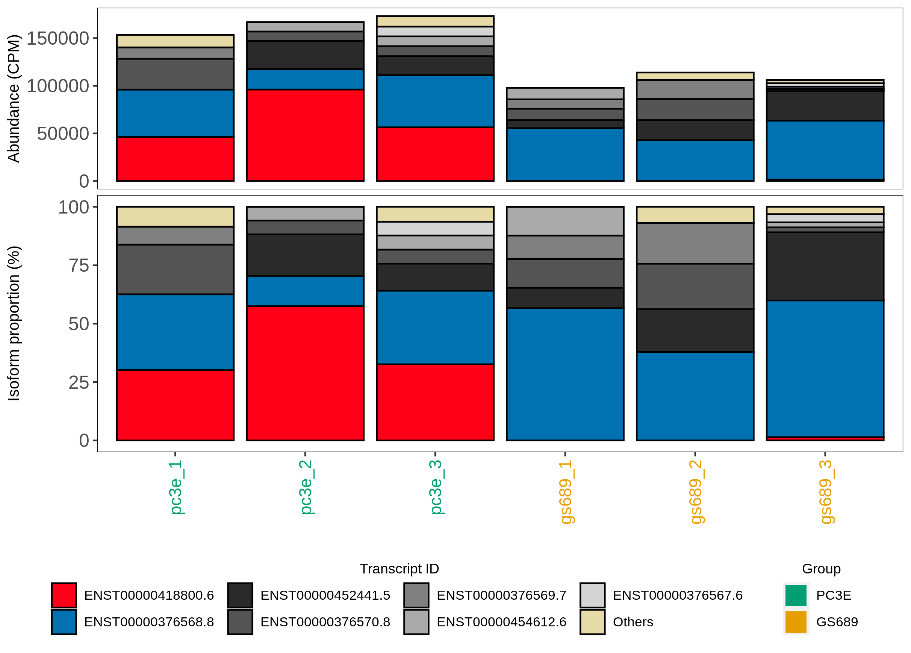
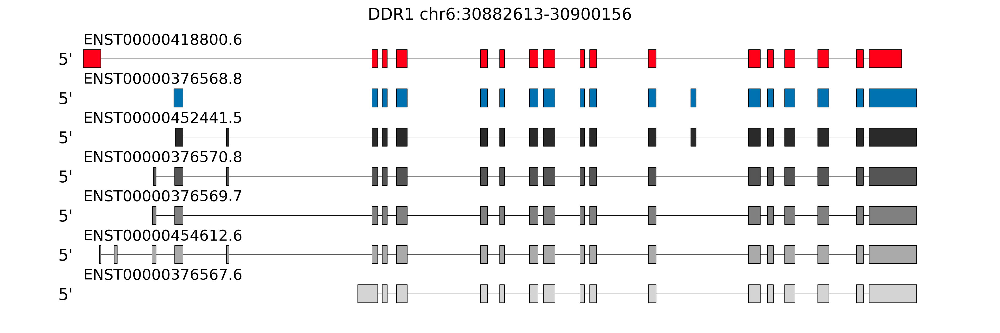
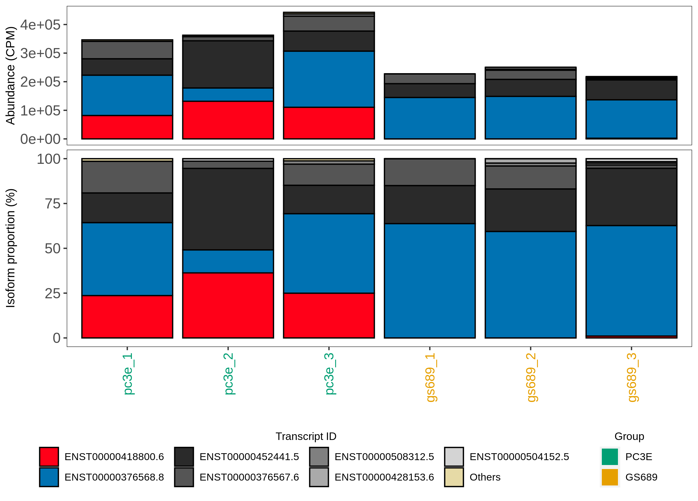
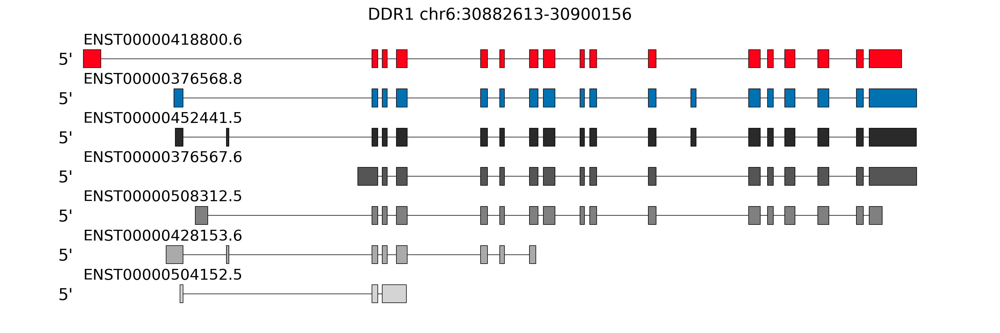
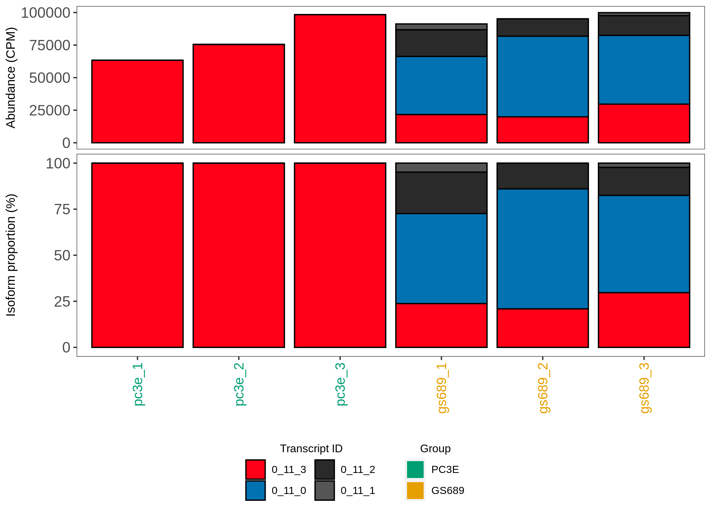
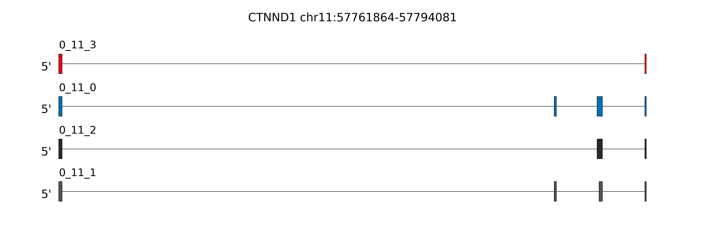
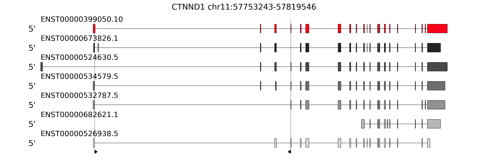
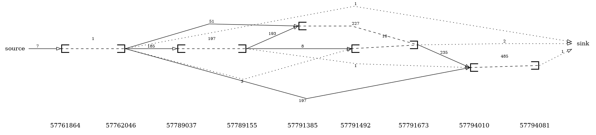
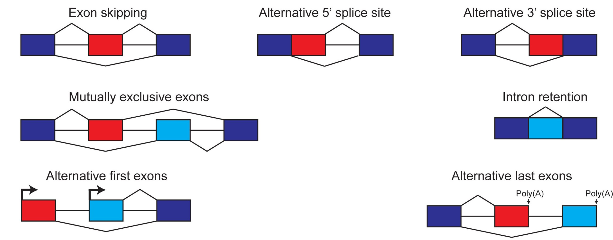

# rMATS-long

[](https://github.com/Xinglab/rMATS-long/releases/latest)
[](https://github.com/Xinglab/rMATS-long/releases)
[](https://anaconda.org/bioconda/rmats-long)

## About

rMATS-long is an integrated computational workflow for long-read RNA-seq data. Building on our ESPRESSO tool for robust transcript discovery and quantification using long-read RNA-seq data, rMATS-long enables differential isoform analysis between sample groups, as well as classification and visualization of isoform structure and abundance.

## Table of Contents

* [Dependencies](#dependencies)
  + [Tests](#tests)
* [Usage](#usage)
  + [Differential Isoform Analysis](#differential-isoform-analysis)
    - [Starting From Quantified Isoforms](#starting-from-quantified-isoforms)
  + [Alternative Splicing Module Analysis](#alternative-splicing-module-analysis)
  + [Snakemake](#snakemake)
  + [Examples](#examples)
    - [Isoform Analysis Example](#isoform-analysis-example)
    - [From Abundance Example](#from-abundance-example)
    - [ASM Analysis Example](#asm-analysis-example)
  + [Individual Scripts](#individual-scripts)
    - [rmats_long.py](#rmats_longpy)
    - [detect_differential_isoforms.py](#detect_differential_isoformspy)
    - [count_significant_isoforms.py](#count_significant_isoformspy)
    - [visualize_isoforms.py](#visualize_isoformspy)
    - [classify_isoform_differences.py](#classify_isoform_differencespy)
    - [FindAltTSEvents.py](#findalttseventspy)
    - [clean_espresso_gtf.py](#clean_espresso_gtfpy)
    - [add_novel_transcripts_to_gtf.py](#add_novel_transcripts_to_gtfpy)
    - [organize_gene_info_by_chr.py](#organize_gene_info_by_chrpy)
    - [simplify_alignment_info.py](#simplify_alignment_infopy)
    - [organize_alignment_info_by_gene_and_chr.py](#organize_alignment_info_by_gene_and_chrpy)
    - [detect_splicing_events.py](#detect_splicing_eventspy)
    - [count_reads_for_asms.py](#count_reads_for_asmspy)
    - [plot_splice_graph.py](#plot_splice_graphpy)
    - [create_gtf_from_asm_definitions.py](#create_gtf_from_asm_definitionspy)
    - [run_stat_model.py](#run_stat_modelpy)

## Dependencies

Dependencies can be installed to a conda environment by running [./install](./install). Then the scripts can be run when the conda environment is activated: `conda activate ./conda_env`

Another option is to install the rmats-long bioconda package:
```
conda install -c conda-forge -c bioconda rmats-long
```
The rMATS-long scripts are included in the bioconda package and will be available in that conda environment at `/path/to/conda_env/rMATS-long/`

* [Python](https://www.python.org/) (v3.11.0)
  + [NetworkX](https://networkx.org/) (v2.8.8)
  + [NumPy](https://numpy.org/) (v1.24.4)
  + [pandas](https://pandas.pydata.org/) (v1.5.3)
  + [matplotlib](https://matplotlib.org/) (v3.7.3)
  + [pydot](https://github.com/pydot/pydot) (v3.0.4)
  + [rpy2](https://github.com/rpy2/rpy2) (v3.5.11)
  + [threadpoolctl](https://github.com/joblib/threadpoolctl) (v3.6.0)
* [R](https://www.r-project.org/) (v4.2.0)
  + [BiocParallel](https://bioconductor.org/packages/release/bioc/html/BiocParallel.html) (v1.32.5)
  + [DRIMSeq](https://bioconductor.org/packages/release/bioc/html/DRIMSeq.html) (v1.26.0)
  + [ggplot2](https://ggplot2.tidyverse.org/) (v3.4.4)
  + [cowplot](https://wilkelab.org/cowplot/index.html) (v1.1.3)
  + [ggrepel](https://ggrepel.slowkow.com/) (v0.9.5)
  + [ggVennDiagram](https://github.com/gaospecial/ggVennDiagram) (v1.5.2)
  + [this.path](https://github.com/ArcadeAntics/this.path) (v2.4.0)
  + [mclogit](https://github.com/melff/mclogit/) (v0.9.6)
* [samtools](https://www.htslib.org/) (v1.18)

Those versions were used during testing. Other versions may also be compatible.

### Tests

With the dependencies installed (and the conda environment activated if needed), the automated tests can be run with: `./run_tests`

An individual test can be run by supplying the path to the `test.py` file: `./run_tests ./tests/se_gene/test.py`

## Usage

rMATS-long can analyze full-length isoforms or alternative splicing modules (ASMs). Full-length isoforms are quantified from long-read data using the code in [scripts/](scripts/) ([Differential Isoform Analysis](#differential-isoform-analysis)). Another option is to detect ASMs from the full-length isoforms and quantify those ASM isoforms ([Alternative Splicing Module Analysis](#alternative-splicing-module-analysis)). Significant changes in isoform usage are detected and visualizations are created. An annotation file with full-length isoforms is required as input. [ESPRESSO](https://github.com/Xinglab/espresso) outputs a `.gtf` file that includes detected novel isoforms which can be used as input. The ESPRESSO output also includes a `.esp` file with isoform abundance by sample that can be used as input ([Starting From Quantified Isoforms](#starting-from-quantified-isoforms)).

### Differential Isoform Analysis

Running [rmats_long.py](#rmats_longpy) with full-length isoforms requires:
* Two groups of samples to compare
* A `.gtf` with isoform definitions
* Either
  + Alignments for each sample
  + Isoform counts for each sample ([Starting From Quantified Isoforms](#starting-from-quantified-isoforms))

The main outputs are:
* Summary information: `summary.txt`, `summary_plot.png`
* List of differential isoforms: `differential_isoforms_filtered.tsv`
* For each gene with a significant isoform:
  + Visualization of the isoform abundance by sample: `results_by_gene/{gene}/{id}_abundance.png`
  + Visualization of the isoform structures: `results_by_gene/{gene}/{id}_structure.png`
  + List of splicing changes between the most significant isoforms: `results_by_gene/{gene}/{id}_isoform_differences_{isoform}_to_{isoform}.tsv`

The main steps are:
* [organize_gene_info_by_chr.py](#organize_gene_info_by_chrpy)
* [simplify_alignment_info.py](#simplify_alignment_infopy)
* [organize_alignment_info_by_gene_and_chr.py](#organize_alignment_info_by_gene_and_chrpy)
* [detect_splicing_events.py](#detect_splicing_eventspy) (`--output-full-gene-asm`)
* [count_reads_for_asms.py](#count_reads_for_asmspy)
* [rmats_long.py](#rmats_longpy) (`--no-splice-graph-plot`)
  + [detect_differential_isoforms.py](#detect_differential_isoformspy)
  + [visualize_isoforms.py](#visualize_isoformspy)
  + [classify_isoform_differences.py](#classify_isoform_differencespy)

See [Isoform Analysis Example](#isoform-analysis-example) for details.

#### Starting From Quantified Isoforms

With isoform counts for each sample already available, [rmats_long.py](#rmats_longpy) can be run directly using the `--abundance` argument.

The main outputs are:
* Summary information: `summary.txt`, `summary_plot.png`
* List of differential isoforms: `differential_transcripts_filtered.tsv`
* For each gene with a significant isoform:
  + Visualization of the isoform abundance by sample: `results_by_gene/{gene}/{gene}_abundance.png`
  + Visualization of the isoform structures: `results_by_gene/{gene}/{gene}_structure.png`
  + List of splicing changes between the most significant isoforms: `results_by_gene/{gene}/{gene}_isoform_differences_{isoform}_to_{isoform}.tsv`

See [From Abundance Example](#from-abundance-example) for details.

### Alternative Splicing Module Analysis

Running [rmats_long.py](#rmats_longpy) with ASMs requires:
* Two groups of samples to compare
* A `.gtf` with isoform definitions
* Alignments for each sample

The main outputs are:
* Summary information: `summary.txt`, `summary_plot.png`
* ASM isoform definitions: `asm.gtf`
* List of differential isoforms: `differential_isoforms_filtered.tsv`
* For each ASM with a significant isoform:
  + Visualization of the isoform abundance by sample: `results_by_gene/{gene}/{asm}_abundance.png`
  + Visualization of the isoform structures: `results_by_gene/{gene}/{asm}_structure.png`
  + Visualization of where the ASM region is within the gene: `results_by_gene/{gene}/{asm}_in_gene.png`
  + Visualization of the ASM splice graph: `results_by_gene/{gene}/{asm}_graph.png`
  + List of splicing changes between the most significant isoforms: `results_by_gene/{gene}/{asm}_isoform_differences_{isoform}_to_{isoform}.tsv`
* If multiple significant ASMs were detected with the same splicing changes between the most significant isoforms then there will be a file listing the "duplicate" ASMs for that gene: `results_by_gene/{gene}/duplicate_asms.tsv`

The main steps are:
* [organize_gene_info_by_chr.py](#organize_gene_info_by_chrpy)
* [simplify_alignment_info.py](#simplify_alignment_infopy)
* [organize_alignment_info_by_gene_and_chr.py](#organize_alignment_info_by_gene_and_chrpy)
* [detect_splicing_events.py](#detect_splicing_eventspy)
* [create_gtf_from_asm_definitions.py](#create_gtf_from_asm_definitionspy)
* [count_reads_for_asms.py](#count_reads_for_asmspy)
* [rmats_long.py](#rmats_longpy)
  + [detect_differential_isoforms.py](#detect_differential_isoformspy)
  + [visualize_isoforms.py](#visualize_isoformspy)
  + [classify_isoform_differences.py](#classify_isoform_differencespy)
  + [plot_splice_graph.py](#plot_splice_graphpy)

See [ASM Analysis Example](#asm-analysis-example) for details.

### Snakemake

`snakemake` can be used to run all the steps in the workflow. After setting the configuration in [snakemake_config.yaml](snakemake_config.yaml) the workflow can be run with:
```
./run_snakemake
```

The main required configuration values are:
* `run_name`: used to name output files
* `gtf_name`: the `.gtf` file to use
* `group_1_samples` and `group_2_samples:`: each entry gives a sample name and a list of `sam` or `bam` alignment files.
* `quantify_full_length_transcripts`: whether to analyze full-length transcripts
* `quantify_asms`: whether to analyze ASM isoforms

A Venn diagram of significant genes will be output if run with both `quantify_full_length_transcripts` and `quantify_asms`.

If using ESPRESSO output then `espresso_gtf` can be set to include detected novel isoforms.

If a file with `gtf_name` is found in `references/` then it will be used. The gtf can also be configured with a URL as explained in the config file.

There are also values to allocate resources like `{job}_mem_gb`, `{job}_threads`, and `{job}_time_hr`.

The files in [snakemake_profile/](snakemake_profile/) are used to allow submitting jobs to an HPC system. The main file is [snakemake_profile/config.v8+.yaml](snakemake_profile/config.v8+.yaml) which sets the commands snakemake will use to interact with the compute cluster.

The snakemake commands are run using [./conda_wrapper](./conda_wrapper) to use the dependencies installed to the conda environment. The [install](install) script writes the `conda_wrapper:` path to [snakemake_config.yaml](snakemake_config.yaml).

The default config is set to run the example files. First unpack the files as in [Examples](#examples). Then set `gtf_name: 'gencode.v43.annotation_filtered.gtf'` in [snakemake_config.yaml](snakemake_config.yaml) and copy the `.gtf` to `references/`:
```
mkdir references
cp example/gencode.v43.annotation_filtered.gtf references/
```

Replace `/path/to/example` with the actual path to [./example](./example) on your system. Finally run `./run_snakemake` to produce output at `./results/example/`

### Examples

Example data is provided in [example/data.tar.gz](example/data.tar.gz). Unpack that file with:
```
cd example/
tar -xvf ./data.tar.gz
```

The unpacked files are:
* `example/gencode.v43.annotation_filtered.gtf`
* `example/GRCh38.primary_assembly.genome_filtered.fa`
* `example/group_1.txt`
* `example/group_2.txt`
* `example/gs689_1_filtered.sam`
* `example/gs689_2_filtered.sam`
* `example/gs689_3_filtered.sam`
* `example/pc3e_1_filtered.sam`
* `example/pc3e_2_filtered.sam`
* `example/pc3e_3_filtered.sam`
* `example/gs689_1_corrected.sam`
* `example/gs689_2_corrected.sam`
* `example/gs689_3_corrected.sam`
* `example/pc3e_1_corrected.sam`
* `example/pc3e_2_corrected.sam`
* `example/pc3e_3_corrected.sam`
* `example/samples_N2_R0_abundance.esp`
* `example/samples_N2_R0_updated.gtf`

The example data is based on cell line data from [https://doi.org/10.1126/sciadv.abq5072](https://doi.org/10.1126/sciadv.abq5072). The 1D cDNA sequencing for GS689 and PC3E was processed to get .sam files. The reference data (gencode .gtf and GRCh38 .fa) and the .sam files were filtered to a few different regions to get a small dataset. ESPRESSO was run to get the corrected alignments, isoform abundance, and updated .gtf

#### Isoform Analysis Example

The analysis is primarily performed one gene at a time. First, process the annotation files to support the gene-based analysis. If using the `updated.gtf` from ESPRESSO, the novel transcripts can be added to a reference annotation with [clean_espresso_gtf.py](#clean_espresso_gtfpy) to handle ESPRESSO formatting of gene IDs and then [add_novel_transcripts_to_gtf.py](#add_novel_transcripts_to_gtfpy):
```
python ./scripts/clean_espresso_gtf.py --in-gtf ./example/samples_N2_R0_updated.gtf --out-gtf ./example_out/espresso_cleaned.gtf
```

```
python ./scripts/add_novel_transcripts_to_gtf.py --espresso-gtf ./example_out/espresso_cleaned.gtf --other-gtf ./example/gencode.v43.annotation_filtered.gtf --out-gtf ./example_out/combined.gtf
```

A directory of sorted annotation files can be created based on the `combined.gtf` from the above steps (or a reference `.gtf`):
```
python ./scripts/organize_gene_info_by_chr.py --gtf ./example_out/combined.gtf --out-dir ./example_out/annotation
```

Next the read alignments can be processed. The input files can be `.sam` or `.bam` files. The example files are ESPRESSO corrected alignments, but the alignments could have been produced by another tool such as `minimap2`. Each file is processed with a command like:
```
python ./scripts/simplify_alignment_info.py --in-file ./example/gs689_1_corrected.sam --out-tsv ./example_out/gs689_1_simplified.tsv
```

The commands for the other files are:
```
python ./scripts/simplify_alignment_info.py --in-file ./example/gs689_2_corrected.sam --out-tsv ./example_out/gs689_2_simplified.tsv
python ./scripts/simplify_alignment_info.py --in-file ./example/gs689_3_corrected.sam --out-tsv ./example_out/gs689_3_simplified.tsv
python ./scripts/simplify_alignment_info.py --in-file ./example/pc3e_1_corrected.sam --out-tsv ./example_out/pc3e_1_simplified.tsv
python ./scripts/simplify_alignment_info.py --in-file ./example/pc3e_2_corrected.sam --out-tsv ./example_out/pc3e_2_simplified.tsv
python ./scripts/simplify_alignment_info.py --in-file ./example/pc3e_3_corrected.sam --out-tsv ./example_out/pc3e_3_simplified.tsv
```

The simplified alignments can then be used to create a directory of sorted alignment files. The script requires a `.tsv` file listing each simplified alignment file along with its sample name. Create a file, `./example_out/samples.tsv`, with:
```
gs689_1	./example_out/gs689_1_simplified.tsv
gs689_2	./example_out/gs689_2_simplified.tsv
gs689_3	./example_out/gs689_3_simplified.tsv
pc3e_1	./example_out/pc3e_1_simplified.tsv
pc3e_2	./example_out/pc3e_2_simplified.tsv
pc3e_3	./example_out/pc3e_3_simplified.tsv
```

Then run:
```
python ./scripts/organize_alignment_info_by_gene_and_chr.py --gtf-dir ./example_out/annotation --out-dir ./example_out/alignments --samples-tsv ./example_out/samples.tsv
```

The alignments need to be checked against the annotation to determine the compatible isoforms for each alignment. In order to use the same isoform compatibility code as the ASM workflow, [detect_splicing_events.py](#detect_splicing_eventspy) is run with `--output-full-gene-asm` to format the isoforms for each gene:
```
python ./scripts/detect_splicing_events.py --gtf-dir ./example_out/annotation --align-dir ./example_out/alignments --out-dir ./example_out/events --output-full-gene-asm
```

Next determine the compatible isoforms for each read with:
```
python ./scripts/count_reads_for_asms.py --event-dir ./example_out/events --gtf-dir ./example_out/annotation --align-dir ./example_out/alignments --out-tsv ./example_out/asm_counts.tsv
```

Finally [rmats_long.py](#rmats_longpy) is run to determine the significant isoforms and produce the final output files. It requires two sample groups to be defined as in `group_1.txt`:
```
pc3e_1,pc3e_2,pc3e_3
```

and `group_2.txt`:
```
gs689_1,gs689_2,gs689_3
```

`--no-splice-graph-plot` is used since the splice graph plot is useful at the ASM level, but not at the gene level where there can be hundreds of isoforms. Here is the main command:
```
python ./scripts/rmats_long.py --gtf-dir ./example_out/annotation --align-dir ./example_out/alignments --event-dir ./example_out/events --asm-counts ./example_out/asm_counts.tsv --gencode-gtf ./example_out/combined.gtf --group-1 ./example/group_1.txt --group-2 ./example/group_2.txt --group-1-name PC3E --group-2-name GS689 --out-dir ./example_out/rmats_long --plot-file-type .png --no-splice-graph-plot
```

`rmats_long.py` will run other commands. For this example it first runs:
```
python ./scripts/detect_differential_isoforms.py --out-dir ./example_out/rmats_long --group-1 ./example/group_1.txt --group-2 ./example/group_2.txt --adj-pvalue 0.05 --delta-proportion 0.05 --num-threads 1 --min-isoform-reads 1 --min-cpm-per-asm 0 --sample-read-total-tsv ./example_out/alignments/sample_read_totals.tsv --limit-asm-to-top-n-isoforms 100 --average-reads-per-group 10 --gene-cpm-tsv ./example_out/alignments/sample_gene_cpm.tsv --asm-proportion-of-gene 0.05 --asm-counts ./example_out/asm_counts.tsv
```

Along with other status messages, that command should print: `found 15 isoforms from 5 ASMs from 5 genes with adj_pvalue <= 0.05 and abs(delta_isoform_proportion) >= 0.05 and average reads per group >= 10.0 and ASM CPM >= 5.0% of gene CPM`. One significant row from `./example_out/rmats_long/differential_isoforms_filtered.tsv` is:
```
asm_id	gene_id	isoform_id	lr	df	pvalue	adj_pvalue	pc3e_1_proportion	pc3e_2_proportion	pc3e_3_proportion	gs689_1_proportion	gs689_2_proportion	gs689_3_proportion	group_1_average_proportion	group_2_average_proportion	delta_isoform_proportion	pc3e_1_count	pc3e_2_count	pc3e_3_count	gs689_1_count	gs689_2_count	gs689_3_count	pc3e_1_cpm	pc3e_2_cpm	pc3e_3_cpm	gs689_1_cpm	gs689_2_cpm	gs689_3_cpm
2_0	ENSG00000204580.14	ENST00000418800.6	175.2	1	5.484e-40	1.782e-38	0.2966	0.5758	0.3235	0	0	0.01423	0.3987	0.004743	0.3939	26.58	41.65	30.72	0	0	2.293	4.551e+04	9.531e+04	5.596e+04	0	0	1512
```

Next it will run a command similar to what is below using some temporary files:
```
python ./scripts/visualize_isoforms.py --gene-id ENSG00000204580.14 --abundance ./example_out/rmats_long/rmats_long_tmp/2_0_abun.tsv --updated-gtf ./example_out/rmats_long/rmats_long_tmp/2_0.gtf --diff-transcripts ./example_out/rmats_long/rmats_long_tmp/diff.tsv --out-dir ./example_out/rmats_long/results_by_gene/ENSG00000204580.14 --group-1 ./example/group_1.txt --group-2 ./example/group_2.txt --group-1-name PC3E --group-2-name GS689 --plot-file-type .png --intron-scaling 1 --max-transcripts 7 --gene-name DDR1 --is-asm --graph-file ./example_out/events/graph_2.txt --asm-id 2_0
```

And produce `./example_out/rmats_long/results_by_gene/ENSG00000204580.14/2_0_abundance.png`:


And `./example_out/rmats_long/results_by_gene/ENSG00000204580.14/2_0_structure.png`:


The plots show that ENST00000418800.6 is abundant in PC3E but only has a few reads in GS689. ENST00000376568.8 has reads in both groups, but is more abundant in GS689. ENST00000418800.6 is the most significant isoform for this gene and ENST00000376568.8 is the most significant isoform that has a delta proportion in the opposite direction of ENST00000418800.6.

The differences between those two selected isoforms are determined with:
```
python ./scripts/classify_isoform_differences.py --updated-gtf ./example_out/rmats_long/rmats_long_tmp/2_0.gtf --out-tsv ./example_out/rmats_long/results_by_gene/ENSG00000204580.14/2_0_isoform_differences_ENST00000418800.6_to_ENST00000376568.8.tsv --main-transcript-id ENST00000418800.6 --second-transcript-id ENST00000376568.8
```

`./example_out/rmats_long/results_by_gene/ENSG00000204580.14/2_0_isoform_differences_ENST00000418800.6_to_ENST00000376568.8.tsv` shows that those two isoforms differ by an alternative first exon and also a skipped exon. This can also be seen in the isoform structure plot:
```
transcript1	transcript2	event	coordinates
ENST00000418800.6	ENST00000376568.8	AFE	chr6:30882613:30882983:+;chr6:30884519:30884710:+
ENST00000418800.6	ENST00000376568.8	SE	chr6:30895404:30895514:+
```

Similar commands are run for the other significant genes. A summary is written to `./example_out/rmats_long/summary.txt`:
```
## [...]/python ./scripts/rmats_long.py --gtf-dir ./example_out/annotation [...]
## source code commit: [...]
## significant differential isoform usage
total significant isoforms: 15
total genes with significant isoforms: 5
total ASMs with significant isoforms: 5
adjusted pvalue threshold: 0.05
delta isoform proportion threshold: 0.05
## alternative splicing classifications between isoform pairs
total classified isoform pairs: 5
exon skipping: 1
alternative 5'-splice site: 0
alternative 3'-splice site: 0
mutually exclusive exons: 0
intron retention: 0
alternative first exon: 0
alternative last exon: 0
complex: 1
combinatorial: 3
alternative endpoints: 0
## Number of isoforms per ASM
total ASMs with 2 isoforms: 0
total ASMs with 3 isoforms: 0
total ASMs with 4 isoforms: 0
total ASMs with 5 isoforms: 1
total ASMs with 6 isoforms: 1
[...]
```

#### From Abundance Example

If isoform abundance by sample is already available then [rmats_long.py](#rmats_longpy) can be run without quantifying the isoform abundance again. The example data includes isoform definitions and abundance values from [ESPRESSO](https://github.com/Xinglab/espresso). The sample names from the abundance file need to be split into groups as done in `group_1.txt`:
```
pc3e_1,pc3e_2,pc3e_3
```

and `group_2.txt`:
```
gs689_1,gs689_2,gs689_3
```

Here is the main command:
```
python ./scripts/rmats_long.py --abundance ./example/samples_N2_R0_abundance.esp --updated-gtf ./example/samples_N2_R0_updated.gtf --gencode-gtf ./example/gencode.v43.annotation_filtered.gtf --group-1 ./example/group_1.txt --group-2 ./example/group_2.txt --group-1-name PC3E --group-2-name GS689 --out-dir ./example_out_from_abun --plot-file-type .png
```

`rmats_long.py` will run other commands. For this example it first runs:
```
python ./scripts/detect_differential_isoforms.py --out-dir ./example_out_from_abun --group-1 ./example/group_1.txt --group-2 ./example/group_2.txt --adj-pvalue 0.05 --delta-proportion 0.05 --num-threads 1 --min-isoform-reads 1 --min-cpm-per-asm 0 --sample-read-total-tsv ./example_out_from_abun/sample_read_totals.tsv --limit-asm-to-top-n-isoforms 100 --average-reads-per-group 10 --gene-cpm-tsv ./example_out_from_abun/sample_gene_cpm.tsv --asm-proportion-of-gene 0.05 --abundance ./example/samples_N2_R0_abundance.esp
```

Along with other status messages, that command should print: `found 8 isoforms from 3 genes with adj_pvalue <= 0.05 and abs(delta_isoform_proportion) >= 0.05 and average reads per group >= 10.0 and ASM CPM >= 5.0% of gene CPM`. One significant row from `./example_out_from_abun/differential_transcripts_filtered.tsv` is:
```
gene_id	feature_id	lr	df	pvalue	adj_pvalue	pc3e_1_proportion	pc3e_2_proportion	pc3e_3_proportion	gs689_1_proportion	gs689_2_proportion	gs689_3_proportion	group_1_average_proportion	group_2_average_proportion	delta_isoform_proportion	pc3e_1_count	pc3e_2_count	pc3e_3_count	gs689_1_count	gs689_2_count	gs689_3_count	pc3e_1_cpm	pc3e_2_cpm	pc3e_3_cpm	gs689_1_cpm	gs689_2_cpm	gs689_3_cpm
ENSG00000204580.14	ENST00000418800.6	101.1	1	8.619e-24	3.62e-23	0.2363	0.3629	0.2497	0	0	0.01065	0.283	0.003551	0.2794	16.54	26.49	22	0	0	1.31	8.148e+04	1.311e+05	1.106e+05	0	0	2319
```

Next it will run a command similar to what is below using some temporary files:
```
python ./scripts/visualize_isoforms.py --gene-id ENSG00000204580.14 --abundance ./example_out_from_abun/rmats_long_tmp/gene_abundance.esp --updated-gtf ./example_out_from_abun/rmats_long_tmp/gene_updated.gtf --diff-transcripts ./example_out_from_abun/rmats_long_tmp/gene_diff_transcripts.tsv --out-dir ./example_out_from_abun/results_by_gene/ENSG00000204580.14 --group-1 ./example/group_1.txt --group-2 ./example/group_2.txt --group-1-name PC3E --group-2-name GS689 --plot-file-type .png --intron-scaling 1 --max-transcripts 7 --gencode-gtf ./example_out_from_abun/rmats_long_tmp/gene_gencode.gtf
```

And produce `./example_out_from_abun/results_by_gene/ENSG00000204580.14/ENSG00000204580.14_abundance.png`:


And `./example_out_from_abun/results_by_gene/ENSG00000204580.14/ENSG00000204580.14_structure.png`:


The plots show that ENST00000418800.6 is abundant in PC3E but only has a few reads in GS689. ENST00000376568.8 has reads in both groups, but is more abundant in GS689. ENST00000418800.6 is the most significant isoform for this gene and ENST00000376568.8 is the most significant isoform that has a delta proportion in the opposite direction of ENST00000418800.6.

The differences between those two selected isoforms are determined with:
```
python ./scripts/classify_isoform_differences.py --updated-gtf ./example_out_from_abun/rmats_long_tmp/gene_updated.gtf --out-tsv ./example_out_from_abun/results_by_gene/ENSG00000204580.14/ENSG00000204580.14_isoform_differences_ENST00000418800.6_to_ENST00000376568.8.tsv --main-transcript-id ENST00000418800.6 --second-transcript-id ENST00000376568.8 --gencode-gtf ./example_out_from_abun/rmats_long_tmp/gene_gencode.gtf
```

`./example_out_from_abun/results_by_gene/ENSG00000204580.14/ENSG00000204580.14_isoform_differences_ENST00000418800.6_to_ENST00000376568.8.tsv` shows that those two isoforms differ by an alternative first exon and also a skipped exon. This can also be seen in the isoform structure plot:
```
transcript1	transcript2	event	coordinates
ENST00000418800.6	ENST00000376568.8	AFE	chr6:30882613:30882983:+;chr6:30884519:30884710:+
ENST00000418800.6	ENST00000376568.8	SE	chr6:30895404:30895514:+
```

Similar commands are run for the other significant genes. A summary is written to `./example_out_from_abun/summary.txt`:
```
## [...]/python ./scripts/rmats_long.py --abundance ./example/samples_N2_R0_abundance.esp [...]
## source code commit: [...]
## significant differential isoform usage
total significant isoforms: 8
total genes with significant isoforms: 3
adjusted pvalue threshold: 0.05
delta isoform proportion threshold: 0.05
## alternative splicing classifications between isoform pairs
total classified isoform pairs: 3
exon skipping: 0
alternative 5'-splice site: 0
alternative 3'-splice site: 0
mutually exclusive exons: 0
intron retention: 0
alternative first exon: 0
alternative last exon: 0
complex: 1
combinatorial: 2
alternative endpoints: 0
```

#### ASM Analysis Example

The workflow will search for ASMs within each gene. First, process the annotation files to support the gene-based analysis. If using the `updated.gtf` from ESPRESSO, the novel transcripts can be added to a reference annotation with [clean_espresso_gtf.py](#clean_espresso_gtfpy) to handle ESPRESSO formatting of gene IDs and then [add_novel_transcripts_to_gtf.py](#add_novel_transcripts_to_gtfpy):
```
python ./scripts/clean_espresso_gtf.py --in-gtf ./example/samples_N2_R0_updated.gtf --out-gtf ./example_out_asm/espresso_cleaned.gtf
```

```
python ./scripts/add_novel_transcripts_to_gtf.py --espresso-gtf ./example_out_asm/espresso_cleaned.gtf --other-gtf ./example/gencode.v43.annotation_filtered.gtf --out-gtf ./example_out_asm/combined.gtf
```

A directory of sorted annotation files can be created based on the `combined.gtf` from the above steps (or a reference `.gtf`):
```
python ./scripts/organize_gene_info_by_chr.py --gtf ./example_out_asm/combined.gtf --out-dir ./example_out_asm/annotation
```

Next the read alignments can be processed. The input files can be `.sam` or `.bam` files. The example files are ESPRESSO corrected alignments, but the alignments could have been produced by another tool such as `minimap2`. Each file is processed with a command like:
```
python ./scripts/simplify_alignment_info.py --in-file ./example/gs689_1_corrected.sam --out-tsv ./example_out_asm/gs689_1_simplified.tsv
```

The commands for the other files are:
```
python ./scripts/simplify_alignment_info.py --in-file ./example/gs689_2_corrected.sam --out-tsv ./example_out_asm/gs689_2_simplified.tsv
python ./scripts/simplify_alignment_info.py --in-file ./example/gs689_3_corrected.sam --out-tsv ./example_out_asm/gs689_3_simplified.tsv
python ./scripts/simplify_alignment_info.py --in-file ./example/pc3e_1_corrected.sam --out-tsv ./example_out_asm/pc3e_1_simplified.tsv
python ./scripts/simplify_alignment_info.py --in-file ./example/pc3e_2_corrected.sam --out-tsv ./example_out_asm/pc3e_2_simplified.tsv
python ./scripts/simplify_alignment_info.py --in-file ./example/pc3e_3_corrected.sam --out-tsv ./example_out_asm/pc3e_3_simplified.tsv
```

The simplified alignments can then be used to create a directory of sorted alignment files. The script requires a `.tsv` file listing each simplified alignment file along with its sample name. Create a file, `./example_out_asm/samples.tsv`, with:
```
gs689_1	./example_out_asm/gs689_1_simplified.tsv
gs689_2	./example_out_asm/gs689_2_simplified.tsv
gs689_3	./example_out_asm/gs689_3_simplified.tsv
pc3e_1	./example_out_asm/pc3e_1_simplified.tsv
pc3e_2	./example_out_asm/pc3e_2_simplified.tsv
pc3e_3	./example_out_asm/pc3e_3_simplified.tsv
```

Then run:
```
python ./scripts/organize_alignment_info_by_gene_and_chr.py --gtf-dir ./example_out_asm/annotation --out-dir ./example_out_asm/alignments --samples-tsv ./example_out_asm/samples.tsv
```

With the `annotation/` and `alignments/` directories ready, the ASMs present in the data can be detected with:
```
python ./scripts/detect_splicing_events.py --gtf-dir ./example_out_asm/annotation --align-dir ./example_out_asm/alignments --out-dir ./example_out_asm/events
```

A `.gtf` file with the ASM definitions can be created with:
```
python ./scripts/create_gtf_from_asm_definitions.py --event-dir ./example_out_asm/events --out-gtf ./example_out_asm/asm.gtf
```

Next the alignments are checked against the ASM definitions to determine the compatible isoforms:
```
python ./scripts/count_reads_for_asms.py --event-dir ./example_out_asm/events --gtf-dir ./example_out_asm/annotation --align-dir ./example_out_asm/alignments --out-tsv ./example_out_asm/asm_counts.tsv
```

Finally [rmats_long.py](#rmats_longpy) is run to determine the significant ASM isoforms and produce the final output files. It requires two sample groups to be defined as in `group_1.txt`:
```
pc3e_1,pc3e_2,pc3e_3
```

and `group_2.txt`:
```
gs689_1,gs689_2,gs689_3
```

Here is the main command:
```
python ./scripts/rmats_long.py --gtf-dir ./example_out_asm/annotation --align-dir ./example_out_asm/alignments --event-dir ./example_out_asm/events --asm-counts ./example_out_asm/asm_counts.tsv --gencode-gtf ./example_out_asm/combined.gtf --group-1 ./example/group_1.txt --group-2 ./example/group_2.txt --group-1-name PC3E --group-2-name GS689 --out-dir ./example_out_asm/rmats_long --plot-file-type .png
```

`rmats_long.py` will run other commands. For this example it first runs:
```
python ./scripts/detect_differential_isoforms.py --out-dir ./example_out_asm/rmats_long --group-1 ./example/group_1.txt --group-2 ./example/group_2.txt --adj-pvalue 0.05 --delta-proportion 0.05 --num-threads 1 --min-isoform-reads 1 --min-cpm-per-asm 0 --sample-read-total-tsv ./example_out_asm/alignments/sample_read_totals.tsv --limit-asm-to-top-n-isoforms 100 --average-reads-per-group 10 --gene-cpm-tsv ./example_out_asm/alignments/sample_gene_cpm.tsv --asm-proportion-of-gene 0.05 --asm-counts ./example_out_asm/asm_counts.tsv
```

Along with other status messages, that command should print: `found 59 isoforms from 20 ASMs from 4 genes with adj_pvalue <= 0.05 and abs(delta_isoform_proportion) >= 0.05 and average reads per group >= 10.0 and ASM CPM >= 5.0% of gene CPM`. One significant row from `./example_out_asm/rmats_long/differential_isoforms_filtered.tsv` is:
```
asm_id	gene_id	isoform_id	lr	df	pvalue	adj_pvalue	pc3e_1_proportion	pc3e_2_proportion	pc3e_3_proportion	gs689_1_proportion	gs689_2_proportion	gs689_3_proportion	group_1_average_proportion	group_2_average_proportion	delta_isoform_proportion	pc3e_1_count	pc3e_2_count	pc3e_3_count	gs689_1_count	gs689_2_count	gs689_3_count	pc3e_1_cpm	pc3e_2_cpm	pc3e_3_cpm	gs689_1_cpm	gs689_2_cpm	gs689_3_cpm
0_11	ENSG00000198561.16	0_11_3	245.5	1	2.54e-55	1.685e-53	1	1	1	0.2361	0.2117	0.2986	1	0.2488	0.7512	36.97	32.97	53.94	17.71	18.21	45.39	6.33e+04	7.545e+04	9.825e+04	2.136e+04	2.014e+04	2.992e+04
```

Next it will run a command similar to what is below using some temporary files:
```
python ./scripts/visualize_isoforms.py --gene-id ENSG00000198561.16 --abundance ./example_out_asm/rmats_long/rmats_long_tmp/0_11_abun.tsv --updated-gtf ./example_out_asm/rmats_long/rmats_long_tmp/0_11.gtf --diff-transcripts ./example_out_asm/rmats_long/rmats_long_tmp/diff.tsv --out-dir ./example_out_asm/rmats_long/results_by_gene/ENSG00000198561.16 --group-1 ./example/group_1.txt --group-2 ./example/group_2.txt --group-1-name PC3E --group-2-name GS689 --plot-file-type .png --intron-scaling 1 --max-transcripts 7 --gene-name CTNND1 --is-asm --graph-file ./example_out_asm/events/graph_0.txt --asm-id 0_11
```

And produce `./example_out_asm/rmats_long/results_by_gene/ENSG00000198561.16/0_11_abundance.png`:


And `./example_out_asm/rmats_long/results_by_gene/ENSG00000198561.16/0_11_structure.png`:


The plots show that `0_11_3` which skips both exons is the only isoform in PC3E samples. In GS689 samples the most abundant isoform is `0_11_0` which includes both exons. `0_11_3` is the most significant isoform for this gene and `0_11_0` is the most significant isoform that has a delta proportion in the opposite direction of `0_11_3`.

Another [visualize_isoforms.py](#visualize_isoformspy) command will be run to produce `./example_out_asm/rmats_long/results_by_gene/ENSG00000198561.16/0_11_in_gene.png` which shows where the ASM region is located within the full-length isoforms of the gene:


The differences between those two significant isoforms are determined with:
```
python ./scripts/classify_isoform_differences.py --updated-gtf ./example_out_asm/rmats_long/rmats_long_tmp/0_11.gtf --out-tsv ./example_out_asm/rmats_long/results_by_gene/ENSG00000198561.16/0_11_isoform_differences_0_11_3_to_0_11_0.tsv --main-transcript-id 0_11_3 --second-transcript-id 0_11_0
```

`./example_out_asm/rmats_long/results_by_gene/ENSG00000198561.16/0_11_isoform_differences_0_11_3_to_0_11_0.tsv` shows that this is classified as `COMPLEX` (because of the consecutive exon skipping) and lists the exon coordinates:
```
transcript1	transcript2	event	coordinates
0_11_3	0_11_0	COMPLEX	chr11:57762046:57762046:+;chr11:57794010:57794010:+;chr11:57762046:57762046:+;chr11:57789037:57789155:+;chr11:57791385:57791673:+;chr11:57794010:57794010:+
```

Other significant ASMs detected in ENSG00000198561.16 have the same difference between their selected significant isoforms. `example_out_asm/rmats_long/results_by_gene/ENSG00000198561.16/duplicate_asms.tsv` has one line for each set of ASMs that have the same isoform differences. The line for this consecutive exon skipping is:
```
0_11	0_16	0_12	0_14	0_17	0_15	0_19
```

`0_11` is the first ASM in that row because it has the fewest isoforms. Only `0_11` from that row will be used when producing the values in `summary.txt`

A diagram of the splice graph will also be produced with:
```
python ./scripts/plot_splice_graph.py --event-dir ./example_out_asm/events --chr chr11 --gene-id ENSG00000198561.16 --asm-id 0_11 --out-file ./example_out_asm/rmats_long/results_by_gene/ENSG00000198561.16/0_11_graph.png
```


Similar commands are run for the other significant ASMs. A summary is written to `./example_out_asm/rmats_long/summary.txt`:
```
## [...]/python ./scripts/rmats_long.py --gtf-dir ./example_out_asm/annotation [...]
## source code commit: [...]
## significant differential isoform usage
total significant isoforms: 20
total genes with significant isoforms: 4
total ASMs with significant isoforms: 9
adjusted pvalue threshold: 0.05
delta isoform proportion threshold: 0.05
## alternative splicing classifications between isoform pairs
total classified isoform pairs: 9
exon skipping: 4
alternative 5'-splice site: 0
alternative 3'-splice site: 0
mutually exclusive exons: 0
intron retention: 0
alternative first exon: 1
alternative last exon: 0
complex: 4
combinatorial: 0
alternative endpoints: 0
## Number of isoforms per ASM
total ASMs with 2 isoforms: 3
total ASMs with 3 isoforms: 4
total ASMs with 4 isoforms: 1
[...]
```

### Individual Scripts

#### rmats_long.py

```
python rmats_long.py -h

usage: rmats_long.py [-h] [--abundance ABUNDANCE] [--updated-gtf UPDATED_GTF]
                     [--use-drimseq] [--event-dir EVENT_DIR]
                     [--asm-counts ASM_COUNTS] [--align-dir ALIGN_DIR]
                     [--gtf-dir GTF_DIR] --group-1 GROUP_1 --group-2 GROUP_2
                     --out-dir OUT_DIR [--gencode-gtf GENCODE_GTF]
                     [--group-1-name GROUP_1_NAME]
                     [--group-2-name GROUP_2_NAME] [--num-threads NUM_THREADS]
                     [--process-top-n PROCESS_TOP_N]
                     [--process-selected PROCESS_SELECTED]
                     [--plot-file-type {.pdf,.png,all}]
                     [--intron-scaling INTRON_SCALING]
                     [--max-transcripts MAX_TRANSCRIPTS]
                     [--diff-transcripts DIFF_TRANSCRIPTS]
                     [--adj-pvalue ADJ_PVALUE] [--use-unadjusted-pvalue]
                     [--delta-proportion DELTA_PROPORTION]
                     [--compare-all-within-gene] [--covar-tsv COVAR_TSV]
                     [--min-cpm-per-asm MIN_CPM_PER_ASM]
                     [--no-splice-graph-plot]
                     [--min-isoform-reads MIN_ISOFORM_READS]
                     [--limit-asm-to-top-n-isoforms LIMIT_ASM_TO_TOP_N_ISOFORMS]
                     [--average-reads-per-group AVERAGE_READS_PER_GROUP]
                     [--average-cpm-per-group AVERAGE_CPM_PER_GROUP]
                     [--min-cpm-per-group MIN_CPM_PER_GROUP]
                     [--asm-proportion-of-gene ASM_PROPORTION_OF_GENE]

Identify significant splicing changes and produce plots

options:
  -h, --help            show this help message and exit

Gene isoforms:
  Use either Gene isoforms or ASM isoforms

  --abundance ABUNDANCE
                        The path to the abundance.esp file from ESPRESSO
  --updated-gtf UPDATED_GTF
                        The path to the updated.gtf file from ESPRESSO
  --use-drimseq         Use DRIMSeq instead of run_stat_model.py

ASM isoforms:
  Use either ASM isoforms or Gene isoforms

  --event-dir EVENT_DIR
                        The output directory from detect_splicing_events.py
  --asm-counts ASM_COUNTS
                        The output file from count_reads_for_asms.py
  --align-dir ALIGN_DIR
                        The output directory from
                        organize_alignment_info_by_gene_and_chr.py
  --gtf-dir GTF_DIR     The output directory from organize_gene_info_by_chr.py

Required:
  --group-1 GROUP_1     The path to a file listing the sample names for group
                        1. The file should have a single line with the sample
                        names as a comma separated list. The sample names
                        should match with the ESPRESSO abundance column names
                        or --asm-counts names.
  --group-2 GROUP_2     The path to a file listing the sample names for group
                        2
  --out-dir OUT_DIR     The path to use as the output directory

Optional:
  --gencode-gtf GENCODE_GTF
                        The path to a gencode annotation.gtf file. Will be
                        used to identify the Ensembl canonical isoform and the
                        gene name
  --group-1-name GROUP_1_NAME
                        A name for group 1 (default group 1)
  --group-2-name GROUP_2_NAME
                        A name for group 2 (default group 2)
  --num-threads NUM_THREADS
                        The number of threads to use (default 1)
  --process-top-n PROCESS_TOP_N
                        Generate plots and classify isoform differences for
                        the top "n" significant genes. By default all
                        significant genes are processed
  --process-selected PROCESS_SELECTED
                        A comma separated list of gene IDs or ASM IDs to
                        generate plots and classify isoform differences for
  --plot-file-type {.pdf,.png,all}
                        The file type for output plots (default .png))
  --intron-scaling INTRON_SCALING
                        The factor to use to reduce intron length in the plot.
                        A value of 2 would reduce introns to 1/2 of the
                        original plot length (default 1)
  --max-transcripts MAX_TRANSCRIPTS
                        How many transcripts to plot individually. The
                        remaining transcripts in the gene will be grouped
                        together (default 7)
  --diff-transcripts DIFF_TRANSCRIPTS
                        The path to the differential transcript results. If
                        given then skip the differential isoform calculation.
  --adj-pvalue ADJ_PVALUE
                        The cutoff for adjusted p-value (default 0.05)
  --use-unadjusted-pvalue
                        Use pvalue instead of adj_pvalue for the cutoff
  --delta-proportion DELTA_PROPORTION
                        The cutoff for delta isoform proportion (default 0.05)
  --compare-all-within-gene
                        Compare the most significant isoform to all other
                        isoforms in the gene. By default, the most significant
                        isoform is only compared to the most significant
                        isoform with a delta proportion in the opposite
                        direction.
  --covar-tsv COVAR_TSV
                        A .tsv with 1 line per sample. The first line has the
                        column names. The first column is sample_id. Each
                        additional column is a covariate.
  --min-cpm-per-asm MIN_CPM_PER_ASM
                        Only consider ASMs where at least 1 sample has at
                        least this CPM of reads assigned to the ASM. (default
                        0)
  --no-splice-graph-plot
                        Do not run plot_splice_graph.py
  --min-isoform-reads MIN_ISOFORM_READS
                        Only consider isoforms with at least this many reads
                        (default 1)
  --limit-asm-to-top-n-isoforms LIMIT_ASM_TO_TOP_N_ISOFORMS
                        Only consider the top N isoforms with the highest
                        total proportion across samples for each ASM (default
                        50)
  --average-reads-per-group AVERAGE_READS_PER_GROUP
                        For each sample group require the average read count
                        to be at least this value in order to be significant
                        (default 10)
  --average-cpm-per-group AVERAGE_CPM_PER_GROUP
                        For each sample group require the average CPM to be at
                        least this value in order to be significant
  --min-cpm-per-group MIN_CPM_PER_GROUP
                        For each sample group require the min CPM to be at
                        least this value in order to be significant
  --asm-proportion-of-gene ASM_PROPORTION_OF_GENE
                        Require the ASM CPM to be at least this proportion of
                        the gene CPM in at least 1 sample in order to be
                        significant (default 0.05)
```

#### detect_differential_isoforms.py

[scripts/detect_differential_isoforms.py](scripts/detect_differential_isoforms.py) detects differential isoform usage. The samples need to be separated into `--group-1` and `--group-2` input files as comma separated lists.

The main output file has these columns:
* `gene_id`
* `isoform_id`: isoform ID
* `lr`: likelihood ratio statistic
* `df`: degrees of freedom
* `pvalue`
* `adj_pvalue`: adjusted p-value
* `{sample_name}_proportion`: proportion of this isoform among all isoforms in this gene (1 column per sample)
* `group_1_average_proportion`
* `group_2_average_proportion`
* `delta_isoform_proportion`: `group_1_average_proportion - group_2_average_proportion`

`differential_isoforms_filtered.tsv` contains only the rows meeting the significance cutoffs.

A summary of the number of isoforms and genes passing the default filters will be printed to stdout. The counts using different filters can be printed using [count_significant_isoforms.py](#count_significant_isoformspy).

```
python detect_differential_isoforms.py -h

usage: detect_differential_isoforms.py [-h] [--abundance ABUNDANCE]
                                       [--asm-counts ASM_COUNTS] --out-dir
                                       OUT_DIR --group-1 GROUP_1 --group-2
                                       GROUP_2 [--num-threads NUM_THREADS]
                                       [--adj-pvalue ADJ_PVALUE]
                                       [--use-unadjusted-pvalue]
                                       [--delta-proportion DELTA_PROPORTION]
                                       [--covar-tsv COVAR_TSV] [--use-drimseq]
                                       [--min-cpm-per-asm MIN_CPM_PER_ASM]
                                       --sample-read-total-tsv
                                       SAMPLE_READ_TOTAL_TSV
                                       [--min-isoform-reads MIN_ISOFORM_READS]
                                       [--limit-asm-to-top-n-isoforms LIMIT_ASM_TO_TOP_N_ISOFORMS]
                                       [--average-reads-per-group AVERAGE_READS_PER_GROUP]
                                       [--average-cpm-per-group AVERAGE_CPM_PER_GROUP]
                                       [--min-cpm-per-group MIN_CPM_PER_GROUP]
                                       [--asm-proportion-of-gene ASM_PROPORTION_OF_GENE]
                                       --gene-cpm-tsv GENE_CPM_TSV

Detect differential isoform expression using a multinomial model

options:
  -h, --help            show this help message and exit
  --abundance ABUNDANCE
                        The path to the abundance.esp file from ESPRESSO
  --asm-counts ASM_COUNTS
                        The output file from count_reads_for_asms.py
  --out-dir OUT_DIR     The path to use as the output directory
  --group-1 GROUP_1     The path to a file listing the sample names for group
                        1. The file should have a single line with the sample
                        names as a comma separated list. The sample names
                        should match with the ESPRESSO abundance column names.
  --group-2 GROUP_2     The path to a file listing the sample names for group
                        2.
  --num-threads NUM_THREADS
                        The number of threads to use (default: 1)
  --adj-pvalue ADJ_PVALUE
                        The cutoff for adjusted p-value (default: 0.05)
  --use-unadjusted-pvalue
                        Use pvalue instead of adj_pvalue for the cutoff
  --delta-proportion DELTA_PROPORTION
                        The cutoff for delta isoform proportion (default:
                        0.05)
  --covar-tsv COVAR_TSV
                        A .tsv with 1 line per sample. The first line has the
                        column names. The first column is sample_id. Each
                        additional column is a covariate.
  --use-drimseq         Use DRIMSeq instead of run_stat_model.py
  --min-cpm-per-asm MIN_CPM_PER_ASM
                        Only consider ASMs where at least 1 sample has at
                        least this CPM of reads assigned to the ASM. (default:
                        0)
  --sample-read-total-tsv SAMPLE_READ_TOTAL_TSV
                        A .tsv file with two columns: sample and total. The
                        1st line is the header
  --min-isoform-reads MIN_ISOFORM_READS
                        Only consider isoforms with at least this many reads
                        (default: 1)
  --limit-asm-to-top-n-isoforms LIMIT_ASM_TO_TOP_N_ISOFORMS
                        Only consider the top N isoforms with the highest
                        total proportion across samples for each ASM (default:
                        50)
  --average-reads-per-group AVERAGE_READS_PER_GROUP
                        For each sample group require the average read count
                        to be at least this value in order to be significant
                        (default: 10)
  --average-cpm-per-group AVERAGE_CPM_PER_GROUP
                        For each sample group require the average CPM to be at
                        least this value in order to be significant
  --min-cpm-per-group MIN_CPM_PER_GROUP
                        For each sample group require the min CPM to be at
                        least this value in order to be significant
  --asm-proportion-of-gene ASM_PROPORTION_OF_GENE
                        Require the ASM CPM to be at least this proportion of
                        the gene CPM in at least 1 sample in order to be
                        significant (default: 0.05)
  --gene-cpm-tsv GENE_CPM_TSV
                        A .tsv file with gene_id as the 1st header and then an
                        additional header for each sample name
```

#### count_significant_isoforms.py

```
python count_significant_isoforms.py -h

usage: count_significant_isoforms.py [-h] --diff-transcripts DIFF_TRANSCRIPTS
                                     --diff-asms DIFF_ASMS --out-tsv OUT_TSV
                                     [--adj-pvalue ADJ_PVALUE]
                                     [--use-unadjusted-pvalue]
                                     [--delta-proportion DELTA_PROPORTION]
                                     [--is-asm]
                                     [--average-reads-per-group AVERAGE_READS_PER_GROUP]
                                     [--average-cpm-per-group AVERAGE_CPM_PER_GROUP]
                                     [--min-cpm-per-group MIN_CPM_PER_GROUP]
                                     [--asm-proportion-of-gene ASM_PROPORTION_OF_GENE]
                                     --group-1 GROUP_1 --group-2 GROUP_2

Count isoforms that meet the cutoff values

options:
  -h, --help            show this help message and exit
  --diff-transcripts DIFF_TRANSCRIPTS
                        The path to the differential transcript results
  --diff-asms DIFF_ASMS
                        The path to the differential asms results
  --out-tsv OUT_TSV     The path to write transcripts that meet the cutoff
                        values
  --adj-pvalue ADJ_PVALUE
                        The cutoff for adjusted p-value (default: 0.05)
  --use-unadjusted-pvalue
                        Use pvalue instead of adj_pvalue for the cutoff
  --delta-proportion DELTA_PROPORTION
                        The cutoff for delta isoform proportion (default:
                        0.05)
  --is-asm              Use if running with ASM output
  --average-reads-per-group AVERAGE_READS_PER_GROUP
                        For each sample group require the average read count
                        to be at least this value in order to be significant
                        (default: 10)
  --average-cpm-per-group AVERAGE_CPM_PER_GROUP
                        For each sample group require the average CPM to be at
                        least this value in order to be significant
  --min-cpm-per-group MIN_CPM_PER_GROUP
                        For each sample group require the min CPM to be at
                        least this value in order to be significant
  --asm-proportion-of-gene ASM_PROPORTION_OF_GENE
                        Require the ASM CPM to be at least this proportion of
                        the gene CPM in at least 1 sample in order to be
                        significant (default: 0.05)
  --group-1 GROUP_1     The path to a file listing the sample names for group
                        1. The file should have a single line with the sample
                        names as a comma separated list.
  --group-2 GROUP_2     The path to a file listing the sample names for group
                        2
```

#### visualize_isoforms.py

[scripts/visualize_isoforms.py](scripts/visualize_isoforms.py) creates plots showing the isoform abundance and structure. The `--gene-id` can be selected from the [differential isoform test](#detect_differential_isoformspy). The `--abundance` and `--updated-gtf` files are from the ESPRESSO output. By default, the most abundant isoforms for the gene will be plotted. Specific isoforms can be plotted with `--main-transcript-ids` or isoforms can be determined automatically if `--diff-transcripts` or `--gencode-gtf` are given. The most significant isoform and another significant isoform with opposite `delta_isoform_proportion` will be chosen from `--diff-transcripts` and the Ensembl canonical transcript will be selected based on a tag in the `--gencode-gtf`.

```
python visualize_isoforms.py -h

usage: visualize_isoforms.py [-h] --gene-id GENE_ID [--gene-name GENE_NAME]
                             [--asm-id ASM_ID] [--abundance ABUNDANCE]
                             --updated-gtf UPDATED_GTF
                             [--gencode-gtf GENCODE_GTF] [--asm-gtf ASM_GTF]
                             [--diff-transcripts DIFF_TRANSCRIPTS] --out-dir
                             OUT_DIR [--plot-file-type {.pdf,.png,all}]
                             [--main-transcript-ids MAIN_TRANSCRIPT_IDS]
                             [--max-transcripts MAX_TRANSCRIPTS]
                             [--intron-scaling INTRON_SCALING]
                             [--group-1 GROUP_1] [--group-2 GROUP_2]
                             [--group-1-name GROUP_1_NAME]
                             [--group-2-name GROUP_2_NAME] [--is-asm]
                             [--start-coord START_COORD]
                             [--end-coord END_COORD] [--graph-file GRAPH_FILE]

Visualize the structure and abundance of isoforms

options:
  -h, --help            show this help message and exit
  --gene-id GENE_ID     The gene_id to visualize
  --gene-name GENE_NAME
                        The name for the gene (used as plot title). If not
                        given then the gene_name from --gencode-gtf will be
                        used. If no other name is found then --gene-id is used
                        as a default
  --asm-id ASM_ID       The asm_id to use with --asm-gtf
  --abundance ABUNDANCE
                        The path to the abundance.esp file from ESPRESSO
  --updated-gtf UPDATED_GTF
                        The path to the updated.gtf file from ESPRESSO
  --gencode-gtf GENCODE_GTF
                        The path to a gencode annotation.gtf file. Can be used
                        to identify the gene_name and Ensembl canonical
                        isoform
  --asm-gtf ASM_GTF     The path to a .gtf file with ASM transcripts. Can be
                        used to select which gene transcripts to plot
  --diff-transcripts DIFF_TRANSCRIPTS
                        The path to the differential transcript results. Can
                        be used to determine --main-transcript-ids
  --out-dir OUT_DIR     The path to use as the output directory
  --plot-file-type {.pdf,.png,all}
                        The file type for output plots (default .png))
  --main-transcript-ids MAIN_TRANSCRIPT_IDS
                        A comma separated list of transcript IDs to plot as
                        the main transcripts. If not given then the most
                        significant isoform from --diff-transcripts, a second
                        significant isoform with a delta proportion in the
                        opposite direction, and the Ensembl canonical isoform
                        from --gencode-gtf will be used if possible
  --max-transcripts MAX_TRANSCRIPTS
                        How many transcripts to plot individually. The
                        remaining transcripts in the gene will be grouped
                        together (default 7)
  --intron-scaling INTRON_SCALING
                        The factor to use to reduce intron length in the plot.
                        A value of 2 would reduce introns to 1/2 of the
                        original plot length (default 1)
  --group-1 GROUP_1     The path to a file listing the sample names for group
                        1. The file should have a single line with the sample
                        names as a comma separated list. The sample names
                        should match with the ESPRESSO abundance column names.
  --group-2 GROUP_2     The path to a file listing the sample names for group
                        2.
  --group-1-name GROUP_1_NAME
                        A name for group 1 (default group 1)
  --group-2-name GROUP_2_NAME
                        A name for group 2 (default group 2)
  --is-asm              Use ASM data
  --start-coord START_COORD
                        Indicate the start of a region at this coordinate
  --end-coord END_COORD
                        Indicate the end of a region at this coordinate
  --graph-file GRAPH_FILE
                        The path to graph_{chr}.txt which has the splice graph
                        details for this gene
```

#### classify_isoform_differences.py

[scripts/classify_isoform_differences.py](scripts/classify_isoform_differences.py) compares the structures of isoforms within a gene by calling [FindAltTSEvents.py](#findalttseventspy) with a "main" isoform and a second isoform (or all other isoforms in the gene by default).

```
python classify_isoform_differences.py -h

usage: classify_isoform_differences.py [-h] --main-transcript-id
                                       MAIN_TRANSCRIPT_ID --updated-gtf
                                       UPDATED_GTF [--gencode-gtf GENCODE_GTF]
                                       --out-tsv OUT_TSV
                                       [--second-transcript-id SECOND_TRANSCRIPT_ID]

Compare the structures of isoforms within a gene

options:
  -h, --help            show this help message and exit
  --main-transcript-id MAIN_TRANSCRIPT_ID
                        The transcript_id of the main isoform in the .gtf file
  --updated-gtf UPDATED_GTF
                        The path to the updated.gtf file from ESPRESSO
  --gencode-gtf GENCODE_GTF
                        The path to a gencode annotation.gtf file. Can be used
                        to compare against isoforms not detected by ESPRESSO
  --out-tsv OUT_TSV     The path of the output file
  --second-transcript-id SECOND_TRANSCRIPT_ID
                        If given, only compare the main transcript to this
                        transcript
```

#### FindAltTSEvents.py

[scripts/FindAltTSEvents.py](scripts/FindAltTSEvents.py) compares the structures of any two transcript isoforms. Local differences in transcript structure are classified into 7 basic alternative splicing categories:



* Exon skipping (SE)
* Alternative 5'-splice site (A5SS)
* Alternative 3'-splice site (A3SS)
* Mutually exclusive exons (MXE)
* Intron retention (RI)
* Alternative first exon (AFE)
* Alternative last exon (ALE)

Any local differences in transcript structure that could not be classified as one of the 7 basic alternative splicing categories are classified as "complex" (COMPLEX). **Note:** It is possible to have combinations of alternative splicing events for any given pair of transcript isoforms.

The output is a tab-delimited file consisting of four fields:
* **Field 1**: ID for transcript isoform 1
* **Field 2**: ID for transcript isoform 2
* **Field 3**: Discovered alternative splicing events
* **Field 4**: Genomic coordinates for alternative splicing events

**Note:** Designation of transcript isoforms 1 and 2 is completely arbitrary. Moreover, if the two transcript isoforms contained in the input GTF file exhibit a combination of multiple alternative splicing events, each event will be reported as its own line in the output file.

```
python FindAltTSEvents.py -h

usage: FindAltTSEvents.py [-h] -i /path/to/input/GTF -o /path/to/output/file

This is a script to enumerate all transcript structure differences between a
pair of transcript isoforms

options:
  -h, --help            show this help message and exit
  -i /path/to/input/GTF
                        path to GTF file describing structures of two
                        transcript isoforms
  -o /path/to/output/file
                        path to output file
```

#### clean_espresso_gtf.py

Some `novel_isoform` entries in the ESPRESSO `updated.gtf` can be assigned to multiple genes. The `gene_id` attribute will have all of the assigned genes in a comma separated list. [scripts/clean_espresso_gtf.py](scripts/clean_espresso_gtf.py) replaces each entry with multiple genes with separate entries for each gene.

```
python clean_espresso_gtf.py -h

usage: clean_espresso_gtf.py [-h] --in-gtf IN_GTF --out-gtf OUT_GTF

Cleanup gene IDs from ESPRESSO's updated.gtf

options:
  -h, --help         show this help message and exit
  --in-gtf IN_GTF    the updated.gtf from ESPRESSO
  --out-gtf OUT_GTF  where to write the cleaned gtf
```

#### add_novel_transcripts_to_gtf.py

```
python add_novel_transcripts_to_gtf.py -h

usage: add_novel_transcripts_to_gtf.py [-h] --espresso-gtf ESPRESSO_GTF
                                       --other-gtf OTHER_GTF --out-gtf OUT_GTF

Add ESPRESSO novel transcripts to a gtf

options:
  -h, --help            show this help message and exit
  --espresso-gtf ESPRESSO_GTF
                        the updated.gtf from ESPRESSO
  --other-gtf OTHER_GTF
                        a gtf to add novel transcripts to
  --out-gtf OUT_GTF     where to write the output gtf
```

#### organize_gene_info_by_chr.py

[scripts/organize_gene_info_by_chr.py](scripts/organize_gene_info_by_chr.py) creates a directory of sorted files which allows other steps to be more efficient. `chr_name_id_mapping.tsv` identifies which chromosome corresponds to each file.

```
python organize_gene_info_by_chr.py -h

usage: organize_gene_info_by_chr.py [-h] --gtf GTF --out-dir OUT_DIR

Create 1 file per chr with transcript info by gene

options:
  -h, --help         show this help message and exit
  --gtf GTF          The path to a gtf with transcript info
  --out-dir OUT_DIR  The directory to create and where chr files will be
                     written
```

#### simplify_alignment_info.py

```
python simplify_alignment_info.py -h

usage: simplify_alignment_info.py [-h] --in-file IN_FILE --out-tsv OUT_TSV
                                  [--sort-buffer-size SORT_BUFFER_SIZE]

Read a SAM or BAM file and output the splice junctions for each read

options:
  -h, --help            show this help message and exit
  --in-file IN_FILE     The path to a .sam or .bam file
  --out-tsv OUT_TSV     The path to write the output reads
  --sort-buffer-size SORT_BUFFER_SIZE
                        Used for the --buffer-size argument of sort. Default:
                        2G
```

#### organize_alignment_info_by_gene_and_chr.py

Similar to [organize_gene_info_by_chr.py](#organize_gene_info_by_chrpy) [scripts/organize_alignment_info_by_gene_and_chr.py](scripts/organize_alignment_info_by_gene_and_chr.py) creates a directory of sorted files which allows other steps to be more efficient. `sample_read_totals.tsv` records the total number of reads for each sample.

```
python organize_alignment_info_by_gene_and_chr.py -h

usage: organize_alignment_info_by_gene_and_chr.py [-h] --gtf-dir GTF_DIR
                                                  --out-dir OUT_DIR
                                                  --samples-tsv SAMPLES_TSV
                                                  [--sort-buffer-size SORT_BUFFER_SIZE]

Create 1 file per chr with read info by gene

options:
  -h, --help            show this help message and exit
  --gtf-dir GTF_DIR     The output directory from organize_gene_info_by_chr.py
  --out-dir OUT_DIR     The directory to create and where new files will be
                        written
  --samples-tsv SAMPLES_TSV
                        The path to a file where each line has 2 tab separated
                        columns: sample name, then a path to an output file
                        from simplify_alignment_info.py. A sample name can
                        have multiple lines if it has multiple input files.
  --sort-buffer-size SORT_BUFFER_SIZE
                        Used for the --buffer-size argument of sort. Default:
                        2G
```

#### detect_splicing_events.py

[scripts/detect_splicing_events.py](scripts/detect_splicing_events.py) finds ASMs using a `.gtf` file. The transcripts for each gene are used to build a splice graph which is filtered if `--align-dir` and `--min-reads-per-edge` are provided. Then a search is performed for regions in the graph with multiple possible paths. In order to avoid computational issues with large and complex genes, the search is limited using `--max-nodes-in-event`.

```
python detect_splicing_events.py -h

usage: detect_splicing_events.py [-h] --gtf-dir GTF_DIR
                                 [--align-dir ALIGN_DIR] --out-dir OUT_DIR
                                 [--max-nodes-in-event MAX_NODES_IN_EVENT]
                                 [--max-paths-in-event MAX_PATHS_IN_EVENT]
                                 [--num-threads NUM_THREADS]
                                 [--min-reads-per-edge MIN_READS_PER_EDGE]
                                 [--output-full-gene-asm]
                                 [--simplify-gene-isoform-endpoints]
                                 [--filter-gene-isoforms-by-edge]

Detect alternative splicing events from a set of isoforms

options:
  -h, --help            show this help message and exit
  --gtf-dir GTF_DIR     The output directory from organize_gene_info_by_chr.py
  --align-dir ALIGN_DIR
                        The output directory from
                        organize_alignment_info_by_gene_and_chr.py
  --out-dir OUT_DIR     The directory to create and where chr files will be
                        written
  --max-nodes-in-event MAX_NODES_IN_EVENT
                        Only look for events between nodes (splice sites) in
                        the splice graph that are at most --max-nodes-in-event
                        apart. Default: 50
  --max-paths-in-event MAX_PATHS_IN_EVENT
                        Only output events with at most --max-paths-in-event.
                        Default: 50
  --num-threads NUM_THREADS
                        how many threads to use. Default: 1
  --min-reads-per-edge MIN_READS_PER_EDGE
                        Only include an edge in the splice graph if there are
                        at least this many supporting reads. Default: 5
  --output-full-gene-asm
                        Output only ASMs that cover the entire gene (from
                        transcript start to end)
  --simplify-gene-isoform-endpoints
                        Combine gene isoforms where the only difference is the
                        transcripts start and/or end
  --filter-gene-isoforms-by-edge
                        With --output-full-gene-asm, require each isoform to
                        have --min-reads-per-edge for each splice junction
```

#### count_reads_for_asms.py

```
python count_reads_for_asms.py -h

usage: count_reads_for_asms.py [-h] --event-dir EVENT_DIR --align-dir
                               ALIGN_DIR --gtf-dir GTF_DIR --out-tsv OUT_TSV
                               [--num-threads NUM_THREADS]
                               [--sort-buffer-size SORT_BUFFER_SIZE]

Determine read counts for isoforms in ASMs

options:
  -h, --help            show this help message and exit
  --event-dir EVENT_DIR
                        The output directory from detect_splicing_events.py
  --align-dir ALIGN_DIR
                        The output directory from
                        organize_alignment_info_by_gene_and_chr.py
  --gtf-dir GTF_DIR     The output directory from organize_gene_info_by_chr.py
  --out-tsv OUT_TSV     The output file for ASM read counts
  --num-threads NUM_THREADS
                        how many threads to use
  --sort-buffer-size SORT_BUFFER_SIZE
                        Used for the --buffer-size argument of sort. Default:
                        2G
```

#### plot_splice_graph.py

[scripts/plot_splice_graph.py](scripts/plot_splice_graph.py) creates a diagram of the splice graph for an ASM. The edges in the graphs will show the number of reads aligned to that junction or exon if [detect_splicing_events.py](#detect_splicing_eventspy) was run with `--align-dir`.

```
python plot_splice_graph.py -h

usage: plot_splice_graph.py [-h] --event-dir EVENT_DIR [--chr CHR]
                            [--gene-id GENE_ID] [--asm-id ASM_ID] --out-file
                            OUT_FILE [--edge-label-lines]
                            [--min-edge-weight MIN_EDGE_WEIGHT]
                            [--show-extra-nodes]

Plot the splice graph for a gene or ASM

options:
  -h, --help            show this help message and exit
  --event-dir EVENT_DIR
                        The output directory from detect_splicing_events.py
  --chr CHR             The chromosome name with the gene or ASM
  --gene-id GENE_ID     The gene ID to plot
  --asm-id ASM_ID       The ASM ID to plot
  --out-file OUT_FILE   The file for the output plot
  --edge-label-lines    draw a line connecting each edge label to its edge
  --min-edge-weight MIN_EDGE_WEIGHT
                        only draw edges with at least this weight
  --show-extra-nodes    include nodes other than the main annotated
                        coordinates
```

#### create_gtf_from_asm_definitions.py

```
python create_gtf_from_asm_definitions.py -h

usage: create_gtf_from_asm_definitions.py [-h] --event-dir EVENT_DIR --out-gtf
                                          OUT_GTF

Create a .gtf file with ASM definitions

options:
  -h, --help            show this help message and exit
  --event-dir EVENT_DIR
                        The output directory from detect_splicing_events.py
  --out-gtf OUT_GTF     The output .gtf file to create
```

#### run_stat_model.py

```
python run_stat_model.py -h

usage: run_stat_model.py [-h] [--counts-tsv COUNTS_TSV]
                         [--abundance ABUNDANCE] --out-dir OUT_DIR --group-1
                         GROUP_1 --group-2 GROUP_2 [--num-threads NUM_THREADS]
                         [--group-1-name GROUP_1_NAME]
                         [--group-2-name GROUP_2_NAME]
                         [--min-isoform-reads MIN_ISOFORM_READS]
                         [--limit-asm-to-top-n-isoforms LIMIT_ASM_TO_TOP_N_ISOFORMS]
                         [--min-cpm-per-asm MIN_CPM_PER_ASM]
                         --sample-read-total-tsv SAMPLE_READ_TOTAL_TSV
                         [--em-tolerance EM_TOLERANCE]
                         [--em-max-iter EM_MAX_ITER]
                         [--random-seed RANDOM_SEED]
                         [--progress-every-n PROGRESS_EVERY_N]
                         [--sort-buffer-size SORT_BUFFER_SIZE]
                         [--covar-tsv COVAR_TSV]

Run a statistical model on isoform counts

options:
  -h, --help            show this help message and exit

Read compatibility:
  Use either Read compatibility or Transcript abundance

  --counts-tsv COUNTS_TSV
                        The input read isoform compatibility

Transcript abundance:
  Use either Transcript abundance or Read compatibility

  --abundance ABUNDANCE
                        The path to the transcript abundance by sample

Required:
  --out-dir OUT_DIR     The directory to write output to
  --group-1 GROUP_1     The path to a file listing the sample names for group
                        1. The file should have a single line with the sample
                        names as a comma separated list.
  --group-2 GROUP_2     The path to a file listing the sample names for group
                        2

Optional:
  --num-threads NUM_THREADS
                        How many threads to use (default 1)
  --group-1-name GROUP_1_NAME
                        A name for group 1 (default group_1)
  --group-2-name GROUP_2_NAME
                        A name for group 2 (default group_2)
  --min-isoform-reads MIN_ISOFORM_READS
                        Only consider isoforms with at least this many reads
                        (default 1)
  --limit-asm-to-top-n-isoforms LIMIT_ASM_TO_TOP_N_ISOFORMS
                        Only consider the top N isoforms with the highest
                        total proportion across samples for each ASM (default:
                        50)
  --min-cpm-per-asm MIN_CPM_PER_ASM
                        Only consider ASMs where at least 1 sample has at
                        least this CPM of reads assigned to the ASM. (default
                        0)
  --sample-read-total-tsv SAMPLE_READ_TOTAL_TSV
                        A .tsv file with two columns: sample and total. The
                        1st line is the header
  --em-tolerance EM_TOLERANCE
                        Stop performing EM iterations when the change is at or
                        below this value (default 0.001)
  --em-max-iter EM_MAX_ITER
                        Perform at most this many EM iterations (default 100)
  --random-seed RANDOM_SEED
                        Passed to R base::set.seed() (default 123)
  --progress-every-n PROGRESS_EVERY_N
                        Print a status message after a certain number of ASMs
                        (default 100)
  --sort-buffer-size SORT_BUFFER_SIZE
                        Used for the --buffer-size argument of sort. Default:
                        2G
  --covar-tsv COVAR_TSV
                        A .tsv with 1 line per sample. The first line has the
                        column names. The first column is sample_id. Each
                        additional column is a covariate.
```
